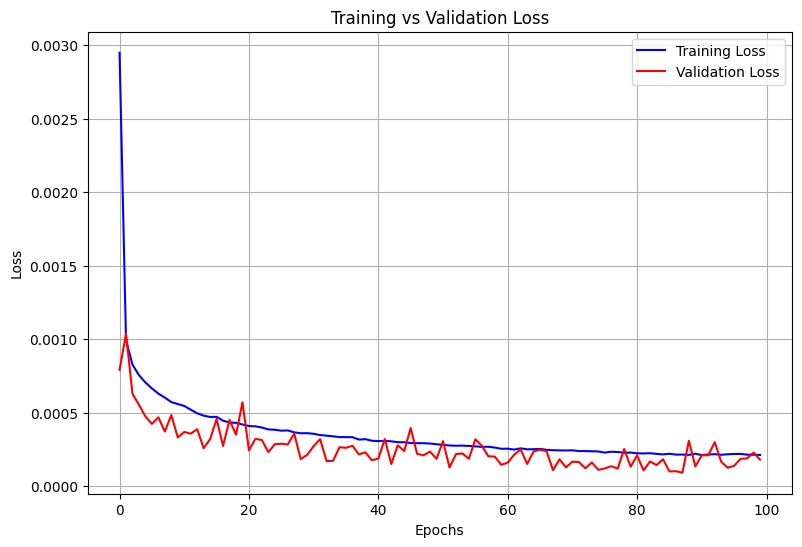
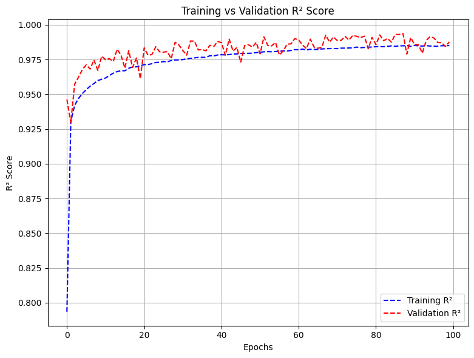

# 🔍 Workload Prediction in Edge Computing using GRU

## 📘 Project Introduction

With the rapid growth of edge computing, predicting dynamic workloads accurately is essential for maintaining service quality and optimizing infrastructure. This project presents a deep learning-based approach for workload prediction, leveraging temporal patterns in traffic data to forecast future demand and enable intelligent resource provisioning.

We explored several models, including LSTM and CNN+LSTM, and found GRU (Gated Recurrent Unit) to be the most efficient and accurate for our use case.

---

## ⚙️ Key Features

- **GRU-Based Deep Learning Model**  
  A recurrent neural network tailored for time-series data, optimized for predicting workload fluctuations in edge environments.

- **Temporal Feature Engineering**  
  Extracted features such as hour of the day, day of the week, and weekend indicator to capture temporal variations effectively.

- **Model Comparison**  
  Conducted comprehensive testing of LSTM and CNN+LSTM architectures; GRU outperformed them in both accuracy and efficiency.

- **Hyperparameter Optimization**  
  Fine-tuned learning rate, hidden layers, and sequence window size. Integrated early stopping to avoid overfitting.

- **Classification Approach**  
  Transformed continuous traffic data into four workload categories: Low, Medium, High, and Very High.

- **Visualization Tools**  
  Plotted actual vs. predicted traffic trends and included confusion matrices to evaluate model accuracy across classes.

---

## 📈 Visualizations

### Actual vs Predicted Traffic (GRU Model)
.png)

### Training vs Validation Loss

### Training vs Validation (R2 Score)

---

## 📊 Final Model Performance (GRU)

| Metric          | Value     |
|-----------------|-----------|
| **R² Score**     | 0.98    |
| **MAE**          | 0.13      |
| **MSE**          | 0.06      |

These results indicate highly precise forecasting, making the model suitable for real-time workload management and decision support in edge systems.

## 📦 Dataset

The model was trained and validated using the **China ISP Dataset**, which contains anonymized network traffic data.

📥 [Download Dataset from Github](https://github.com/BuptMecMigration/Edge-Computing-Dataset)  
---
